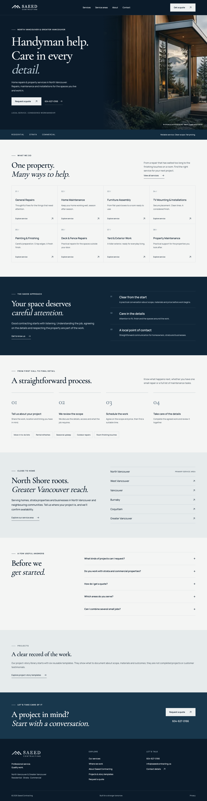

# Saeed Contracting

A production Next.js website for a North Vancouver contracting and property-services business. The site turns a silver-and-navy business-card identity into an accessible, responsive customer experience with individual service pages and a transparent quote workflow.

**[Production deployment](https://saeed-contracting.vercel.app)** · **[Canonical domain](https://saeedcontracting.ca)** · **[Launch & operations guide](docs/OPERATIONS.md)**

> Launch status: live at **https://saeedcontracting.ca** with working HTTPS and a path-preserving 301 from `www`. The quote form sends directly through a verified Resend subdomain. One live test confirmed both the business notification and customer acknowledgement were delivered. Vercel rate limiting is active; iCloud incoming mail is preserved.



## Technology

- Next.js 16.3.6 App Router, React 19, strict TypeScript and Tailwind CSS 4
- Server Components and static generation for content; small client boundaries for navigation and the form
- Vercel hosting with GitHub integration; `main` is the production source of truth
- Playwright, axe-core, Node test runner and GitHub Actions
- Self-hosted Manrope and Cormorant Garamond through `next/font`

## Pages

| Page                        | URL                                   |
| --------------------------- | ------------------------------------- |
| Home                        | `/`                                   |
| Services                    | `/services`                           |
| General Repairs             | `/services/general-repairs`           |
| Home Maintenance            | `/services/home-maintenance`          |
| Furniture Assembly          | `/services/furniture-assembly`        |
| TV Mounting & Installations | `/services/tv-mounting-installations` |
| Painting & Finishing        | `/services/painting-finishing`        |
| Deck & Fence Repairs        | `/services/deck-fence-repairs`        |
| Yard & Exterior Work        | `/services/yard-exterior-work`        |
| Property Maintenance        | `/services/property-maintenance`      |
| About                       | `/about`                              |
| Service Areas               | `/service-areas`                      |
| Contact                     | `/contact`                            |
| Request a Quote             | `/request-a-quote`                    |
| Privacy                     | `/privacy`                            |
| Projects                    | `/projects`                           |
| Six blank story templates   | `/projects/templates/[slug]`          |

The sitemap contains 16 indexable pages. The six clearly labelled blank templates use `noindex, follow` and are excluded from the sitemap.

A custom 404, `sitemap.xml`, `robots.txt`, SVG favicon, Apple touch icon and brand social card are also included.

## Architecture

```text
src/app/                 Pages, metadata routes and the quote endpoint
src/components/          Shared layout, navigation, service grid and quote UI
src/lib/services.ts      Typed public catalogue, content and publish controls
src/lib/site.ts          Consistent business identity and metadata helpers
src/lib/quote.ts         Shared validation and plain-text request formatting
public/brand/            Web vector logo variants and icon mark
brand/references/        Unmodified original business-card/logo references
tests/                   Browser/accessibility and delivery-logic tests
docs/                    Screenshots, asset provenance and operations
```

All public service consumers use the published catalogue. Future regulated-service configuration stays disabled; no electrical-services page, public claim, dropdown item or sitemap entry is emitted. See the operations guide before enabling a new category.

## SEO and local relevance

- Unique titles/descriptions, absolute canonical URLs, Open Graph and Twitter metadata
- North Vancouver as the primary area; useful content for West Vancouver, Vancouver, Burnaby, Coquitlam and Greater Vancouver without duplicate location pages
- HomeAndConstructionBusiness JSON-LD with a truthful service catalogue, plus website, service, breadcrumb and visible FAQ markup
- Unique North Vancouver service copy and links between services, service areas, contact, quote and project planning
- [90-day SEO plan, Search Console instructions, keyword map and before/after checklist](docs/SEO-PLAN.md)
- Consistent name, phone and email; no invented street address, credentials, reviews or operating history
- Crawlable internal links, semantic headings, sitemap and robots; preview noindex headers
- Search Console verification configuration and a documented future analytics integration

## Quote workflow

The production form validates customer details and sends directly, showing an accessible on-page confirmation after provider acceptance. Failures preserve details and offer retry, call and email alternatives. Missing configuration falls back to clearly labelled email drafting.

Direct submission sends a business notification with customer Reply-To and a branded customer confirmation in a Resend batch. Stable idempotency keys protect retries, and customer/provider details stay out of logs. Input limits, validation, origin checks, honeypot and timing checks are combined with a verified Vercel rate limit (10 attempts per IP per 10 minutes). Turnstile remains available as an additional check. The sender is verified and the domain-restricted key is stored as a sensitive Vercel production variable; see [delivery verification](docs/OPERATIONS.md#verified-production-delivery).

## Accessibility and performance

Keyboard-accessible navigation and FAQ disclosures, Escape-to-close mobile menu, visible focus, skip link, labelled forms, reduced-motion handling and readable contrast. Responsive tests cover 375, 390, 430, 768, 1024, 1440 and 1920 pixels.

The architecture illustration is served locally through Next Image with AVIF/WebP negotiation, responsive sizes and reserved layout space. Content is prerendered; fonts are self-hosted; no animation framework, tracker, map embed or external widget loads in email-draft mode. [Asset provenance](docs/ASSETS.md) documents the original references and generated illustration.

Automated checks are a foundation, not a claim of complete WCAG certification or guaranteed search rankings. Measured launch results are recorded in [verification](docs/VERIFICATION.md).

## Local development

Requires Node.js 22 and npm.

```sh
npm ci
cp .env.example .env.local
npm run dev
```

With empty email/security values, the form stays in email-draft mode. No API key is needed to develop the public site. Never commit real credentials.

```sh
npm run lint
npm run typecheck
npm test
npm run build
npx playwright install chromium
npm run test:e2e
npm run test:delivery
```

The browser suite starts the production server automatically. It checks every public page, local links, metadata, structured-data parsing, keyboard/mobile navigation, form drafting, safe API failures, unknown routes and the unpublished-service boundary. `TEST_BASE_URL` may point to a public deployment for selected read-only QA; exclude the local draft-form test when checking production. The separate local direct-delivery suite intercepts all submissions and never sends email.

## Deploy and maintain

Push to `main` for automatic Vercel production deployment. GitHub Actions run lint, type checking, unit tests, build and browser checks. For an explicitly authorised CLI deployment, link the project and run `vercel --prod`.

DNS, iCloud mail preservation, direct form activation, Search Console and future services are documented in [OPERATIONS.md](docs/OPERATIONS.md). Roll back through Vercel deployment history if needed.

Brand assets and business content belong to Saeed Contracting. This repository is publicly viewable for maintenance and portfolio review; no licence to reuse the business identity is granted.
